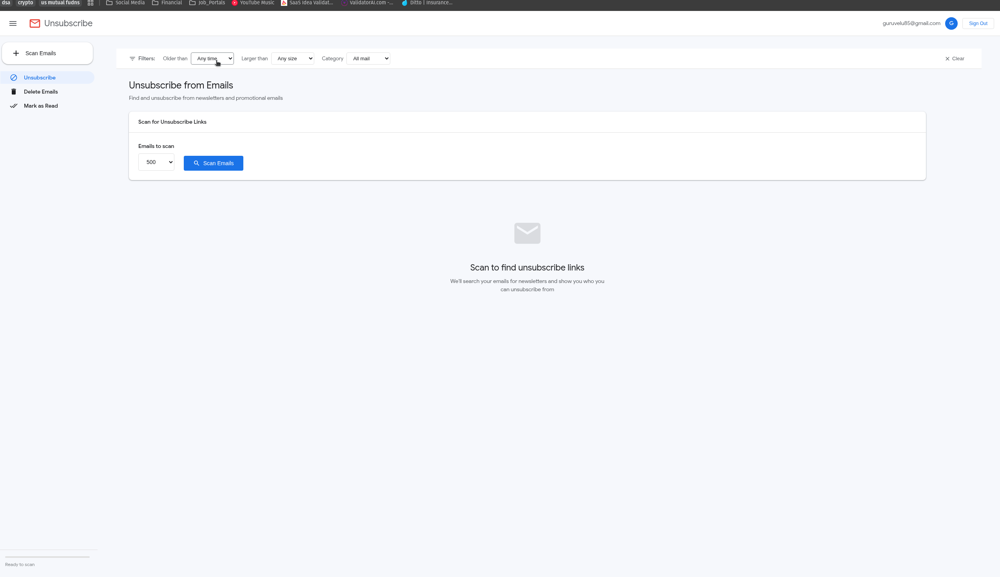

# Gmail Bulk Unsubscribe & Cleanup Tool

A **free**, privacy-focused tool to bulk unsubscribe from emails, delete emails by sender, and mark emails as read. No subscriptions, no data collection - runs 100% on your machine.

[](https://github.com/sponsors/Gururagavendra)
[](https://buymeacoffee.com/gururagavendra)


> **No Subscription Required - Free Forever**

## Features

| Feature | Description |
|---------|-------------|
| **Bulk Unsubscribe** | Find newsletters and unsubscribe with one click |
| **Delete by Sender** | See who sends you the most emails, delete in bulk |
| **Mark as Read** | Bulk mark thousands of unread emails as read |
| **Smart Filters** | Filter by days, size of email, and category (Promotions, Social, Updates) |
| **Privacy First** | Runs locally - your data never leaves your machine |
| **Super Fast** | Gmail API with batch requests (100 emails per API call) |
| **Gmail-style UI** | Clean, familiar interface |

## Platform Support

Works on **all major platforms** - both Docker and local installation:

| Platform | Docker | Local (Python) |
|----------|--------|----------------|
| Linux (x86_64) | Native | Native |
| Windows (x86_64) | Native | Native |
| macOS Intel | Native | Native |
| macOS Apple Silicon (M1/M2/M3/M4) | Native | Native |

## Demo



**[Watch Setup Video on YouTube](https://youtu.be/CmOWn8Tm5ZE)** - Step-by-step video on how to setup the repo and run the project locally.

## Feature Requests

Lets make this tool a better one by improving as much as possible, All features are welcome, To request a feature, [open a GitHub issue](https://github.com/Gururagavendra/gmail-cleaner/issues/new).

## Prerequisites

- **Docker**: [Docker Desktop](https://www.docker.com/products/docker-desktop/)
- **Local (Python)**: [Python 3.9+](https://www.python.org/downloads/) and [uv](https://docs.astral.sh/uv/getting-started/installation/)

## Setup

**Important**: You must create your **OWN** Google Cloud credentials. This app doesn't include pre-configured OAuth - that's what makes it privacy-focused! Each user runs their own instance with their own credentials.

### 1. Get Google OAuth Credentials

**Video Tutorial**: [Watch on YouTube](https://youtu.be/CmOWn8Tm5ZE) for a visual walkthrough

1. Go to [Google Cloud Console](https://console.cloud.google.com/)
2. Create a new project (or select existing)
3. Search for **"Gmail API"** and **Enable** it
4. Go to **Google Auth Platform**  → Click **"Get started"**
5. Fill in the wizard:
   - **App Information**: Enter app name (e.g., "Gmail Cleanup"), select your email
   - **Audience**: Select **External**
   - **Contact Information**: Add your email address
   - Click **Create**
6. Go to **Audience** (left sidebar) → Scroll to **Test users**
   - Click **Add Users** → Add your Gmail address → **Save**
7. Go to **Clients** (left sidebar) → **Create Client**
   - Choose the application type based on your setup:
   
   | Setup | Application Type | Redirect URI |
   |-------|------------------|--------------|
   | **Local/Desktop** (Python with browser) | Desktop app | Not needed |
   | **Docker/Remote Server** | Web application | `http://YOUR_HOST:8767/` |
   
   - Name: "Gmail Cleanup" (or anything)
   - Click **Create**
   - Click **Download** (downloads JSON file)
   - Rename the downloaded file to `credentials.json`

> **💡 Which should I choose?**
> - Running locally with Python (`uv run python main.py`)? → **Desktop app**
> - Running with Docker or on a remote server? → **Web application**

### 2. Clone the Repository

1. Clone the repo:
```bash
git clone https://github.com/Gururagavendra/gmail-cleaner.git
```

2. Navigate to the folder:
```bash
cd gmail-cleaner
```

3. Put your `credentials.json` file in the project folder.

## Usage

### Option A: Docker (Recommended)

1. Start the container:
```bash
docker compose up -d
```

2. Open the app in your browser:
```
http://localhost:8766
```

3. Click **"Sign In"** button in the web UI

4. Check logs for the OAuth URL (only after clicking Sign In!):
```bash
docker logs $(docker ps -q --filter ancestor=ghcr.io/gururagavendra/gmail-cleaner)
```
Or if you built locally:
```bash
docker logs $(docker ps -q --filter name=gmail-cleaner)
```

5. Copy the Google OAuth URL from logs, open in browser, and authorize:
   - Choose your Google account
   - "Google hasn't verified this app" → Click **Continue**
     > This warning appears because you created your own OAuth app (not published to Google). This is expected and safe - you control the app!
   - Grant permissions → Click **Continue**
   - Done! You'll see "Authentication flow has completed"

> **🌐 Using a custom domain or remote server?** See [Custom Domain / Reverse Proxy / Remote Server](#custom-domain--reverse-proxy--remote-server) for configuration instructions.

### Option B: Python (with uv)

```bash
uv sync
uv run python main.py
```

The app opens at http://localhost:8766

## Security & Privacy

- **100% Local** - No external servers, no data collection
- **Open Source** - Inspect all the code yourself
- **Minimal Permissions** - Only requests read + modify (for mark as read)
- **Your Credentials** - You control your own Google OAuth app
- **Gitignored Secrets** - `credentials.json` and `token.json` never get committed

## FAQ

**Q: Why do I need to create my own Google Cloud project?**
> Because this app accesses your Gmail. By using your own OAuth credentials, you have full control and don't need to trust a third party.

**Q: Is this safe?**
> Yes! The code is open source - you can inspect it. Your emails are processed locally on your machine.

**Q: Can I use this for multiple Gmail accounts?**
> Yes! Click "Sign Out" and sign in with a different account. Each account needs to be added as a test user in your Google Cloud project.

**Q: Emails went to Trash, can I recover them?**
> Yes! The delete feature moves emails to Trash. Go to Gmail → Trash to recover within 30 days.

## Troubleshooting

### "Access blocked: Gmail Cleanup has not completed the Google verification process"

This error means you're missing a step in the OAuth setup:

1. Go to [Google Cloud Console](https://console.cloud.google.com/) → Your Project
2. Go to **APIs & Services** → **OAuth consent screen**
3. Scroll down to **Test users**
4. Click **Add Users** and add your Gmail address
5. Try signing in again

> **Why?** Since your app is in "Testing" mode, only emails listed as test users can sign in. This is normal and expected!

### "Error 403: access_denied"

1. Make sure you created your **own** Google Cloud project and credentials
2. Make sure your email is added as a **Test user**
3. Make sure you downloaded `credentials.json` and placed it in the project folder

### Docker: "Where do I find the OAuth URL?"

Check the container logs:
```bash
docker logs $(docker ps -q --filter name=gmail-cleaner)
```
Look for a URL starting with `https://accounts.google.com/o/oauth2/...`

### Docker: OAuth CSRF Error / State Mismatch

If you see `OAuth error: (mismatching_state) CSRF Warning`:

1. **Stop and clean up:**
   ```bash
   docker compose down
   rm -f token.json
   ```

2. **Clear browser cookies** for `accounts.google.com` (or use incognito/private window)

3. **Start fresh:**
   ```bash
   docker compose up
   ```

4. Copy the OAuth URL from logs and paste in browser

### Custom Domain / Reverse Proxy / Remote Server

If you're accessing the app via a **custom domain** (e.g., `gmail.example.com`) or a **server IP** instead of `localhost`:

> **Important**: You must use **Web application** credentials (not Desktop app) for remote server setups. See [Step 7 in Get Google OAuth Credentials](#1-get-google-oauth-credentials).

1. **Create Web application credentials** in Google Cloud Console:
   - Go to **Clients** → **Create Client** → Select **Web application**
   - Under **Authorized redirect URIs**, add: `http://YOUR_DOMAIN:8767/`
   - Download and rename to `credentials.json`

2. **Set the environment variables** in docker-compose.yml:
   ```yaml
   environment:
     - WEB_AUTH=true
     - OAUTH_HOST=gmail.example.com  # Just the hostname - NO http:// or https://
   ```

   > **⚠️ Common mistake**: Use only the hostname (e.g., `gmail.example.com`), NOT the full URL (e.g., ~~`https://gmail.example.com`~~)

3. **For HTTPS with reverse proxy**: 
   - The OAuth callback still uses HTTP on port 8767 internally
   - Your reverse proxy should forward port 8767 for the OAuth callback
   - The **Authorized redirect URI** in Google Cloud must be `http://YOUR_DOMAIN:8767/` (HTTP, not HTTPS)
   - Alternatively, you can proxy both ports through HTTPS and update the redirect URI accordingly

> **Note**: The OAuth callback must be reachable from your browser. If using a reverse proxy, you may need to proxy both port 8766 (app) and port 8767 (OAuth callback).

### "Google hasn't verified this app" warning

This is normal for personal OAuth apps! Click **Continue** to proceed.

This warning appears because your app isn't published to Google - which is exactly what we want for privacy!

## Contributing

PRs welcome! Please read our [Contributing Guidelines](CONTRIBUTING.md) first.

- Report bugs
- Suggest features
- Improve the UI
- Add new functionality


<p align="center">
  Made to help you escape email hell
</p>
